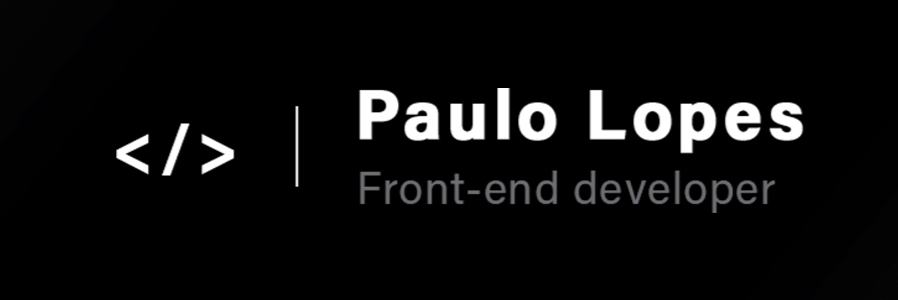

<h1 align="center">
    
</h1>

<h4 align="center">
  Repository in order to consolidate my knowledge in Front-end skills.
</h4>
<p align="center">
  
  
  
  
  
  <a href="https://github.com/lpaulovt/challenges-frontend/commits/master">
    
  </a>
  
  <a href="https://github.com/lpaulovt/challenges-frontend/issues">
    
  </a>
</p>

<p align="center">
    <a href="#latest-challenge">Latest challenge</a>&nbsp;&nbsp;&nbsp; |&nbsp;&nbsp;&nbsp;
    <a href="#rocket-technologies">Technologies</a>&nbsp;&nbsp;&nbsp; |&nbsp;&nbsp;&nbsp;
    <a href="#information_source-how-to-use">How To Use</a>
  
</p>

##  Latest challenge

- <b>Insure landing page</b>

<a href="https://github.com/lpaulovt/challenges-frontend/tree/master/challenge-01" align="center">
    
</a>
<p align="center">
  <a href="https://fmchallenge01.netlify.app/" target="_blank">
    
  </a>
</p>

## :rocket: Technologies

This project was developed with the following technologies:

-  [HTML]()
-  [CSS]()
-  [JavaScript]()

## :information_source: How To Use

To clone and run this application, you'll need [Git](https://git-scm.com). From your command line:

```bash
# Clone this repository
$ git clone https://github.com/lpaulovt/challenges-frontend

# Go into the repository
$ cd challenges-frontend

# Run the app
$ open in your browser
```
---

Made with ❤ by Paulo Lopes :wave: [Get in touch!](https://www.linkedin.com/in/lpaulovt)